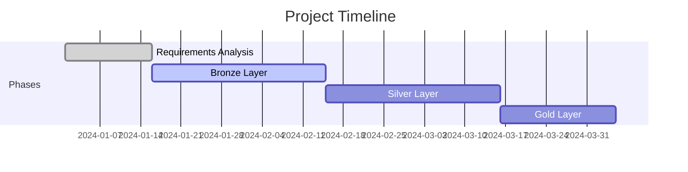

# DataForge Pipeline: Modern Data Warehouse Implementation

  
*Inspired by [Baraa's Data Warehouse Tutorial](https://www.youtube.com/watch?v=9GVqKuTVANE)*

## 📌 Overview
This project implements a **production-grade data warehouse** using a multi-layered architecture (Bronze/Silver/Gold) to transform raw data into business insights. While inspired by [Data with Baraa's tutorial](https://www.youtube.com/watch?v=9GVqKuTVANE), this implementation includes custom adaptations:
- Real-world dataset integration
- Enhanced data validation framework
- Extended documentation for maintainability

## 🛠️ Tech Stack
| Layer        | Technologies Used |
|--------------|-------------------|
| **Bronze**   | Python, SQL        |
| **Silver**   | PySpark, Pandas   |
| **Gold**     | Star Schema SQL    |
| **Tools**    | Draw.io, Git       |

## 🔄 Project Progress


## 📂 Repository Structure
```
DataForge-Pipeline/
├── bronze/       # Raw data ingestion
│   ├── validator.py
│   └── schemas/
├── silver/       # Cleaned data
│   ├── transformer.py
│   └── tests/
├── gold/         # Analytics models
│   ├── star_schema/
│   └── docs/
└── architecture/
    ├── pipeline.drawio
    └── decisions.md
```

## 💡 Key Differentiators
- **Custom Data Quality Checks**: Added schema validation beyond tutorial scope
- **Production-Ready Documentation**: Detailed runbooks and lineage tracking
- **Adapted Architecture**: Modified layer transitions for our specific data needs

## 📜 Academic Integrity
This project follows **best practices** from:
1. [Data with Baraa's YouTube Tutorial](https://www.youtube.com/watch?v=9GVqKuTVANE)
2. Kimball Group's dimensional modeling principles
3. Microsoft's modern data warehouse guidelines

---
[](www.linkedin.com/in/morobang-tshigidimisa-84172b26b)  
📧 **Contact**: morobangtshigidimisa@gmail.com
